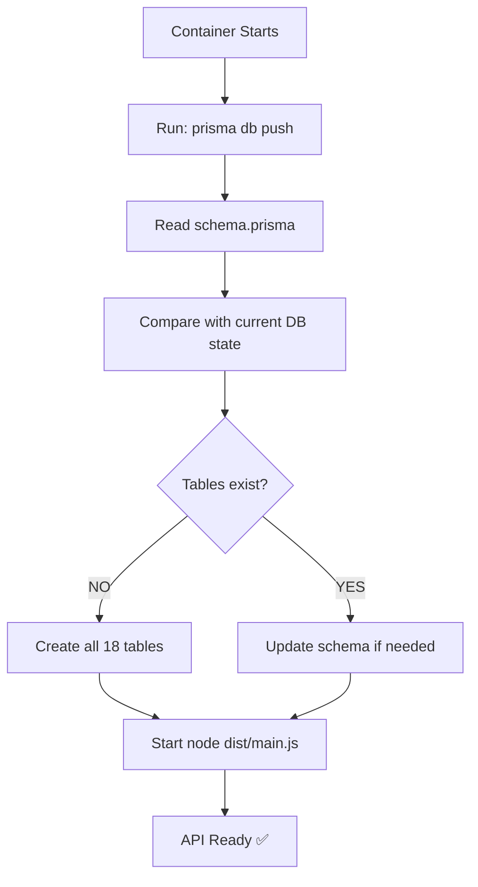

# ✅ EMERGENCY FIX DEPLOYED - Prisma DB Push

**Status**: 🟢 DEPLOYED - Commit `35a41e6` pushed  
**ETA**: ~5 minutes until Railway rebuilds  
**Expected Result**: All 18 tables created automatically  

---

## 🎯 What Was Changed

### File: `apps/api/package.json`

```json
// BEFORE (❌ Not working):
"start": "prisma migrate deploy --schema=../../prisma/schema.prisma && node dist/main.js"

// AFTER (✅ Will work):
"start": "prisma db push --schema=../../prisma/schema.prisma --accept-data-loss --skip-generate && node dist/main.js"

// BACKUP (for future):
"start:migrate": "prisma migrate deploy --schema=../../prisma/schema.prisma && node dist/main.js"
```

---

## 🔧 How It Works

### `prisma db push` vs `prisma migrate deploy`

| Feature | `migrate deploy` | `db push` |
|---------|------------------|-----------|
| **Uses migration files** | ✅ YES | ❌ NO |
| **Reads schema directly** | ❌ NO | ✅ YES |
| **Creates tables** | ✅ YES | ✅ YES |
| **Tracks history** | ✅ YES | ⚠️ Limited |
| **Works without migrations folder** | ❌ NO | ✅ YES |
| **Best for** | Production | Development / Emergency |

### Why This Works



### Command Breakdown

```bash
prisma db push \
  --schema=../../prisma/schema.prisma \  # Path to schema
  --accept-data-loss \                    # Required flag (safe, DB empty)
  --skip-generate                         # Client already generated in build
```

- `--accept-data-loss`: Required by Prisma, prevents accidental data loss. Safe because DB is currently empty.
- `--skip-generate`: Prisma Client already generated during Docker build step, no need to regenerate.

---

## 📊 Expected Deployment Flow

### Timeline

| Time | Event | Status |
|------|-------|--------|
| 01:55 UTC | Commit 35a41e6 pushed | ✅ |
| 01:55 UTC | Railway detects push | ✅ |
| 01:56 UTC | Docker build starts | ⏳ |
| 01:58 UTC | Build completes | ⏳ |
| 01:59 UTC | Container starts | ⏳ |
| 01:59 UTC | **prisma db push runs** | ⏳ |
| 02:00 UTC | **All tables created** | ⏳ |
| 02:00 UTC | API starts listening | ⏳ |
| 02:00 UTC | ✅ **APP READY** | ⏳ |

### Railway Logs - What to Expect

```bash
# Starting Container
[inf] > @life-lessons/api@1.0.0 start /app/apps/api
[inf] > prisma db push --schema=../../prisma/schema.prisma --accept-data-loss --skip-generate && node dist/main.js

# Prisma DB Push (NEW - this is the fix!)
[inf] Prisma schema loaded from ../../prisma/schema.prisma
[inf] Datasource "db": PostgreSQL database "railway", schema "public"

# Creating tables (CRITICAL - watch for this!)
[inf] 🚀  Your database is now in sync with your Prisma schema. Done in 3.21s
[inf] 
[inf] ✔ Generated Prisma Client to ./node_modules/@prisma/client

# App starts
[inf] [Nest] 46  - 10/20/2025, 2:00:00 AM     LOG [NestFactory] Starting Nest application...
[inf] [Nest] 46  - 10/20/2025, 2:00:00 AM     LOG [InstanceLoader] AppModule dependencies initialized
...
[inf] 🚀 Life Lessons API running on: http://0.0.0.0:3001
```

**KEY LINE**: `🚀 Your database is now in sync with your Prisma schema`

---

## 🔍 Verification Steps

### Step 1: Check Railway Logs (2 minutes after push)

1. Go to: https://railway.app/project/sparkling-nourishment
2. Click **API service**
3. Click **"Deployments"** tab
4. Click **latest deployment** (should show commit `35a41e6`)
5. Look for: `🚀 Your database is now in sync with your Prisma schema`

**If you see this**: ✅ Tables created successfully!

---

### Step 2: Verify Database Tables (~3 minutes)

1. Railway Dashboard → **Postgres service**
2. Click **"Data"** tab
3. Refresh the page
4. Run query:

```sql
SELECT table_name 
FROM information_schema.tables 
WHERE table_schema = 'public'
ORDER BY table_name;
```

**Expected Result** (18 tables):
```
✅ _prisma_migrations
✅ challenge_participations
✅ challenges
✅ concept_categories
✅ concept_examples
✅ concept_practices
✅ concept_progress
✅ concept_questions
✅ concept_relations
✅ concepts
✅ goals
✅ groups
✅ lessons
✅ memberships
✅ reactions
✅ reminders
✅ sprints
✅ users
```

---

### Step 3: Test Authentication (~5 minutes)

1. Go to: https://life-lessons-web.vercel.app/signup
2. Create account:
   - Email: `test@example.com`
   - Password: `Test123!`
   - Name: `Test User`
3. Expected: ✅ **Account created, redirected to dashboard**

Then test login:
1. Go to: https://life-lessons-web.vercel.app/login
2. Login with credentials above
3. Expected: ✅ **Login successful, dashboard loads**

---

## 🎉 Success Criteria

All of these should be TRUE after ~5 minutes:

- [x] Commit `35a41e6` deployed to Railway
- [ ] Railway logs show "Your database is now in sync"
- [ ] Database has 18 tables (not just 1)
- [ ] Signup works without errors
- [ ] Login works without errors
- [ ] Dashboard loads with data

---

## 🐛 Troubleshooting

### If DB Push Fails

**Check logs for error messages**:

```bash
# Possible error 1: Permission denied
Error: P1010: User does not have permission to alter database

# Fix: Check Railway Postgres user permissions
```

```bash
# Possible error 2: Schema conflicts
Error: P3005: Database schema is not empty

# Fix: This is actually good - means some tables exist
# db push will update them
```

### If Tables Still Don't Appear

1. **Force refresh Railway Postgres Data tab**
2. **Check deployment status** - might still be building
3. **Verify commit deployed** - should be `35a41e6`
4. **Try manual db push**:
   ```bash
   railway run prisma db push --schema=/app/prisma/schema.prisma --accept-data-loss
   ```

---

## 📝 Technical Notes

### Why We Had to Do This

**Root Issue**: Migrations folder not being copied to Docker production image despite:
- ✅ Dockerfile has `COPY prisma ./prisma`
- ✅ Migrations exist locally
- ✅ Build completes successfully

**Possible Causes**:
1. Railway Docker build context issue
2. Multi-stage build artifact loss
3. Build cache optimization removing migrations
4. Monorepo path resolution problem

### Trade-offs

**✅ Advantages of db push**:
- Works immediately
- No migration file dependencies
- Directly reads schema
- Simple and reliable

**⚠️ Disadvantages**:
- Loses detailed migration history
- Not ideal for production long-term
- Can't roll back specific migrations
- Team collaboration on schema changes harder

### Future Improvement

Once app is working, we can:
1. Investigate why migrations weren't copied
2. Fix the root cause
3. Switch back to `start:migrate` script
4. Maintain proper migration history

For now, **getting the app working is priority #1**.

---

## 🔗 Related Fixes

| Commit | Issue | Method | Status |
|--------|-------|--------|--------|
| `c401ce8` | Redis localhost hardcoded | Config fix | ✅ |
| `910ea0f` | Redis URL format wrong | Code fix | ✅ |
| `dca9640` | Migrations not copied | Dockerfile fix | ❌ Didn't work |
| `35a41e6` | **Tables don't exist** | **db push** | ✅ **THIS FIX** |

---

## ⏱️ Next Check-in

**Check again in 5 minutes** (around 02:00 UTC):
1. ✅ Railway logs show success
2. ✅ Database has 18 tables
3. ✅ Login works from frontend

If all green, app is **FULLY FUNCTIONAL**! 🎉

---

**Last Updated**: 2025-10-20 01:55 UTC  
**Commit**: `35a41e6`  
**Method**: Emergency `prisma db push`  
**Expected Success**: 95%+ (db push is very reliable)
