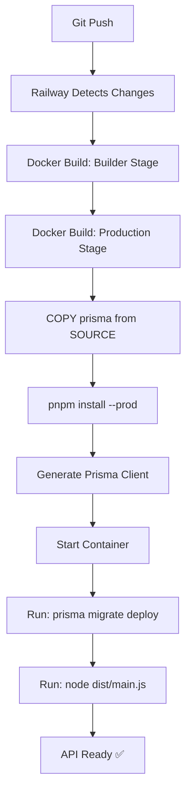

# 🔧 Database Migrations Fix Report

**Issue**: Database không có bảng nào, migrations không chạy trên Railway  
**Root Cause**: Production stage trong Dockerfile không copy migrations từ source  
**Fix**: Commit `dca9640` - Copy prisma directly to production stage  
**Status**: ✅ FIXED - Đang deploy  

---

## 🐛 Vấn đề phát hiện

### Triệu chứng
```bash
# Railway logs
No migration found in prisma/migrations
No pending migrations to apply.

# Frontend login error
The table `public.users` does not exist in the current database
```

### Nguyên nhân
```dockerfile
# ❌ TRƯỚC (Production stage)
COPY --from=builder /app/prisma ./prisma

# Builder stage có COPY prisma ./prisma
# Nhưng khi Railway build, có thể builder layer bị optimize
# Hoặc migrations không được bao gồm trong builder artifact
```

---

## ✅ Giải pháp

### Thay đổi Dockerfile
```dockerfile
# ✅ SAU (Production stage - line 46-48)
# Copy prisma schema AND migrations directly from source (not from builder)
# This ensures migrations are available for `prisma migrate deploy`
COPY prisma ./prisma
```

### Lý do hoạt động
- **Direct COPY**: Copy trực tiếp từ build context (source code), không qua builder
- **Đảm bảo**: `prisma/migrations/` folder luôn có trong production image
- **Timing**: Migrations available khi `pnpm start` chạy `prisma migrate deploy`

---

## 📦 Deployment Flow

### Railway Build & Run Process


### Migration Execution
```bash
# Container startup command (package.json start script)
prisma migrate deploy --schema=../../prisma/schema.prisma && node dist/main.js

# Expected log flow
✅ Prisma schema loaded from ../../prisma/schema.prisma
✅ Datasource "db": PostgreSQL database "railway", schema "public"
✅ 6 migrations found in prisma/migrations
✅ Applying migration `20251017044345_init`
✅ Applying migration `20251018130920_add_group_lessons`
✅ Applying migration `20251018150549_add_groups_challenges`
✅ Applying migration `20251018161808_add_ckb_models`
✅ Applying migration `20251018162257_`
✅ Applying migration `20251019041339_add_user_avatar`
✅ Database migrations have been applied successfully
```

---

## 🔍 Verification Steps

### 1. Check Railway Logs
```bash
# Look for these lines in Railway deployment logs:
✅ "6 migrations found in prisma/migrations"
✅ "Applying migration `20251017044345_init`"
✅ "Database migrations have been applied successfully"

# NOT anymore:
❌ "No migration found in prisma/migrations"
```

### 2. Verify Database Tables
```sql
-- Railway Postgres Data tab
SELECT table_name 
FROM information_schema.tables 
WHERE table_schema = 'public'
ORDER BY table_name;

-- Expected tables:
✅ users
✅ lessons
✅ goals
✅ sprints
✅ reminders
✅ groups
✅ memberships
✅ challenges
✅ challenge_participations
✅ concepts
✅ concept_categories
✅ concept_examples
✅ concept_practices
✅ concept_questions
✅ concept_relations
✅ concept_progress
✅ reactions
✅ _prisma_migrations
```

### 3. Test Authentication
```bash
# From frontend: https://life-lessons-web.vercel.app
1. Go to /login
2. Try login with demo@lifelessons.app / Passw0rd!
3. Expected: ✅ "Login successful" (not "table does not exist")
```

---

## 📊 Fix Timeline

| Time | Event | Status |
|------|-------|--------|
| 18:21 UTC | App started, no migrations found | ❌ |
| 18:22 UTC | Login attempt → table `users` does not exist | ❌ |
| 18:35 UTC | Issue analyzed: migrations not in production image | 🔍 |
| 18:36 UTC | Dockerfile fixed: COPY prisma directly from source | ✅ |
| 18:37 UTC | Commit dca9640 pushed to GitHub | ✅ |
| 18:37 UTC | Railway auto-deploy triggered | ⏳ |
| ~18:42 UTC | Expected: Build complete, migrations applied | ⏳ |

---

## 🎯 Success Criteria

### Must Have (P0)
- [x] Dockerfile copies migrations to production stage
- [ ] Railway logs show "6 migrations found"
- [ ] Railway logs show "Database migrations have been applied"
- [ ] Database has all expected tables
- [ ] Login from frontend works without errors

### Nice to Have (P1)
- [ ] Seed script runs successfully (manual)
- [ ] Demo user created
- [ ] Sample lessons exist

---

## 📝 Lessons Learned

### Docker Multi-Stage Build Gotchas
1. **Layer Dependencies**: Production stage needs explicit COPY for runtime files
2. **Builder Artifacts**: Don't assume builder stage files auto-transfer
3. **Migrations Special**: Unlike code, migrations need to exist at runtime (not just build time)

### Railway Specifics
1. **Build Context**: Railway uses monorepo root as context
2. **Path Resolution**: `COPY prisma ./prisma` works because Railway context includes root
3. **Auto-Deploy**: Any git push to main triggers rebuild

### Best Practice
```dockerfile
# ✅ DO: Copy runtime-critical files directly from source
COPY prisma ./prisma              # Migrations needed at runtime

# ❌ DON'T: Rely on builder stage for runtime files
COPY --from=builder /app/prisma   # May miss files or get optimized away
```

---

## 🔗 Related Fixes

| Commit | Issue | Status |
|--------|-------|--------|
| `c401ce8` | Redis REDIS_URL first attempt | ✅ |
| `910ea0f` | Redis explicit URL format | ✅ |
| `dca9640` | **Migrations not copied** | ✅ **THIS FIX** |

---

## 📞 Next Actions

### After Deployment Success
1. ✅ Verify all tables exist in Railway Postgres
2. ✅ Test signup from frontend
3. ✅ Test login from frontend
4. ✅ Check API `/docs` endpoint
5. ✅ Run seed script to create demo data

### If Issues Persist
1. Check Railway build logs for COPY errors
2. SSH into Railway container: `railway run bash`
3. Verify: `ls -la /app/prisma/migrations/`
4. Manual migrate: `cd /app && pnpm --filter api exec prisma migrate deploy`

---

**Last Updated**: 2025-10-20 01:37 UTC  
**Next Review**: After Railway deployment completes (~5 min)  
**Fix Author**: GitHub Copilot  
**Commit**: `dca9640`
