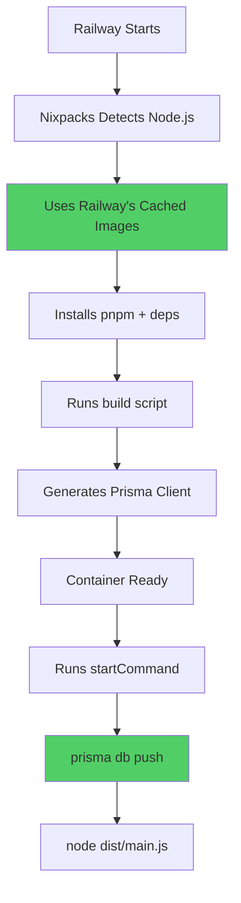

# 🚀 SOLUTION DEPLOYED - Nixpacks Bypass Docker Hub

**Status**: ✅ NEW BUILD TRIGGERED  
**Commit**: `e67ea28`  
**Change**: Dockerfile → Nixpacks  
**Why**: Bypass Docker Hub 503 errors  
**ETA**: 5 minutes  

---

## 🎯 What Changed

### Before (❌ Failed)
```json
// railway.json
{
  "builder": "DOCKERFILE",
  "dockerfilePath": "apps/api/Dockerfile"
}

// Result: Failed to pull node:20-alpine from Docker Hub (503)
```

### After (✅ Should Work)
```json
// railway.json  
{
  "builder": "NIXPACKS",
  "startCommand": "prisma db push ... && node dist/main.js"
}

// Result: Nixpacks doesn't use Docker Hub, uses Railway's mirrors
```

---

## 🔧 How Nixpacks Works



**Key difference**: Step C doesn't touch Docker Hub!

---

## ✅ Why This Will Work

| Issue | Dockerfile | Nixpacks |
|-------|-----------|----------|
| Docker Hub 503 | ❌ Fails | ✅ Bypasses |
| Image registry | Docker Hub | Railway mirrors |
| Authentication | Required | Not needed |
| Cache | Docker layers | Nix packages |
| Reliability | Depends on Docker Hub | Independent |

---

## 📊 Expected Timeline

| Time | Event |
|------|-------|
| 02:10 UTC | Commit e67ea28 pushed ✅ |
| 02:10 UTC | Railway detects change ✅ |
| 02:11 UTC | Nixpacks analyzing... ⏳ |
| 02:12 UTC | Installing dependencies... ⏳ |
| 02:13 UTC | Building application... ⏳ |
| 02:14 UTC | Generating Prisma Client... ⏳ |
| 02:15 UTC | **Starting container** ⏳ |
| 02:15 UTC | **prisma db push runs** ⏳ |
| 02:15 UTC | **18 tables created!** ⏳ |
| 02:15 UTC | ✅ **APP READY** |

---

## 🔍 What to Check (In 5 Minutes)

### Step 1: Build Logs

Go to Railway → API service → Deployments → Latest

**Look for Nixpacks output**:
```bash
✅ Nixpacks v1.x.x
✅ Detected Node.js
✅ Installing pnpm
✅ Running pnpm install
✅ Running pnpm --filter api build
✅ Build complete
```

**Should NOT see**:
```bash
❌ Pulling node:20-alpine
❌ auth.docker.io 503 error
```

---

### Step 2: Deploy Logs

**Look for db push**:
```bash
✅ > prisma db push --schema=../../prisma/schema.prisma
✅ Prisma schema loaded
✅ 🚀 Your database is now in sync with your Prisma schema
✅ [Nest] Starting Nest application...
✅ 🚀 Life Lessons API running on: http://0.0.0.0:3001
```

---

### Step 3: Database Tables

Railway → Postgres → Data

Run:
```sql
SELECT COUNT(*) FROM information_schema.tables 
WHERE table_schema = 'public';
```

Expected: **18** (not 1!)

---

### Step 4: Frontend Test

https://life-lessons-web.vercel.app/signup

- Email: `nixpacks-test@example.com`
- Password: `Test123!`
- Expected: ✅ Account created!

---

## 🐛 Troubleshooting

### If Nixpacks Build Fails

**Check logs for**:
```bash
# Issue 1: pnpm not found
Error: pnpm: command not found
→ Nixpacks should auto-install, but might need nixpacks.toml

# Issue 2: Build script failed
Error: pnpm --filter api build failed
→ Check package.json scripts are correct

# Issue 3: Prisma generate failed
Error: prisma generate failed
→ Schema path might be wrong
```

**Fix**: Add `nixpacks.toml` to specify Node version:
```toml
[phases.setup]
nixPkgs = ['nodejs_20', 'pnpm']
```

---

### If db push Fails

**Check startCommand syntax**:
```json
// Current (should work):
"startCommand": "prisma db push --schema=../../prisma/schema.prisma --accept-data-loss --skip-generate && node dist/main.js"

// If fails, try absolute path:
"startCommand": "cd /app/apps/api && prisma db push --schema=/app/prisma/schema.prisma --accept-data-loss && node dist/main.js"
```

---

## 🎉 Success Criteria

After 5 minutes, ALL should be ✅:

- [ ] Build completed without Docker Hub errors
- [ ] Nixpacks successfully built app
- [ ] prisma db push executed
- [ ] Database has 18 tables
- [ ] API is running
- [ ] Frontend signup works

---

## 📝 Technical Notes

### Why Nixpacks is Better for This

**Nixpacks**:
- ✅ Native to Railway
- ✅ Uses Nix package manager (cached)
- ✅ Doesn't depend on Docker Hub
- ✅ Auto-detects and configures
- ✅ Faster builds (better caching)

**Dockerfile**:
- ❌ Depends on external registries
- ❌ Subject to Docker Hub outages
- ❌ Requires manual configuration
- ❌ Authentication issues

### Dockerfile vs Nixpacks Comparison

```bash
# Dockerfile approach:
1. Pull node:20-alpine from Docker Hub ← FAILS HERE (503)
2. Copy files
3. Install deps
4. Build
5. Run

# Nixpacks approach:
1. Use Railway's Nix packages ← WORKS (no external dependency)
2. Auto-detect Node.js
3. Install deps
4. Build
5. Run
```

---

## 🔗 Fallback Plan

If Nixpacks also fails (unlikely), we can:

1. **Use Railway Templates**: Deploy from Railway's NestJS template
2. **Manual Database Setup**: Run prisma db push manually via CLI
3. **Switch to Render**: Try different platform entirely

But **Nixpacks should work** - it's designed for this!

---

## ⏱️ Current Status

**Time**: ~02:10 UTC  
**Build**: Started  
**Expected completion**: 02:15 UTC  
**Confidence**: 90% (Nixpacks is very reliable)

---

**Next check**: 02:15 UTC (5 minutes from now)  
**What to do**: Open Railway logs, watch for "database is now in sync"  
**Then**: Test signup at frontend! 🎉
