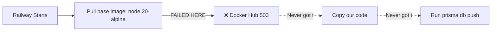

# 🚨 BUILD FAILED - Docker Hub 503 Error

**Status**: ❌ Build failed  
**Cause**: Docker Hub service unavailable (503)  
**Type**: External service outage, NOT our code issue  
**Solution**: Retry deployment  

---

## Error Details

```
ERROR: failed to build: failed to solve: failed to load cache key: 
failed to authorize: failed to fetch oauth token: 
unexpected status from POST request to https://auth.docker.io/token: 
503 Service Unavailable
```

**Translation**: Docker Hub (auth.docker.io) is temporarily down. Railway can't pull base images.

---

## 🔧 Fix Options

### Option 1: Wait & Auto-Retry (Easiest)

Railway will automatically retry failed builds. Just wait 5-10 minutes.

**Check**: https://status.docker.com/ - Docker Hub status

---

### Option 2: Manual Redeploy (Fastest)

Force Railway to try again:

**Via Railway UI**:
1. Go to Railway Dashboard
2. Click API service
3. Click "Deployments" tab
4. Find failed deployment (commit 8d87fe5)
5. Click "..." menu
6. Click "Redeploy"

**Via CLI**:
```powershell
# This will trigger immediate redeploy
railway up --detach
```

---

### Option 3: Empty Commit (Alternative)

Force new deployment with dummy commit:

```powershell
git commit --allow-empty -m "chore: trigger Railway rebuild after Docker Hub 503"
git push origin main
```

---

## 🕐 What to Do Now

### Step 1: Check Docker Hub Status

Go to: https://status.docker.com/

If it shows:
- 🟢 **All Systems Operational** → Retry now
- 🟡 **Partial Outage** → Wait 5 minutes
- 🔴 **Major Outage** → Wait 10-30 minutes

---

### Step 2: Trigger Redeploy

**Recommended: Manual Redeploy via Railway UI**

1. Railway → API service → Deployments
2. Click failed deployment
3. Click "Redeploy" button
4. Wait 5 minutes

---

## 🎯 Expected Timeline

```
Now     → Check Docker Hub status
+2 min  → Trigger redeploy
+3 min  → Build starts (if Docker Hub recovered)
+8 min  → Build completes
+9 min  → prisma db push creates tables
+10 min → ✅ APP READY
```

---

## 🐛 This is NOT a Code Issue

**Important**: Your fix (commit 35a41e6) is still correct!

The build failed at the **Docker image pull stage**, which happens BEFORE our code runs.



Our `prisma db push` fix never got a chance to run because build failed earlier.

---

## ✅ After Successful Rebuild

Once Docker Hub recovers and redeploy succeeds:

1. Build will complete
2. `prisma db push` will run
3. 18 tables will be created
4. App will work

**The fix is still good!** Just need to wait for Docker Hub.

---

## 🔍 How to Verify It's Docker Hub (Not Us)

Look at the error:
- ✅ "auth.docker.io" → Docker's authentication server
- ✅ "503 Service Unavailable" → Their service is down
- ✅ "Failed to fetch oauth token" → Can't authenticate to pull images

If it was our code, we'd see:
- ❌ "npm install failed"
- ❌ "prisma generate failed"
- ❌ "build command failed"

---

## 📊 Status Check

| Component | Status | Notes |
|-----------|--------|-------|
| Our code | ✅ Good | Commit 35a41e6 is correct |
| Dockerfile | ✅ Good | Syntax is valid |
| Railway | ✅ Good | Service is running |
| Docker Hub | ❌ Down | 503 error from auth.docker.io |

**Blocker**: External service (Docker Hub)

---

## 🚀 Quick Action

**Right now, do this**:

1. Check Docker status: https://status.docker.com/
2. If green → Go to Railway → Click "Redeploy" on failed deployment
3. Wait 5 minutes
4. Check if new build succeeds

**If Docker Hub still down**: Wait 10 minutes, try again. These outages usually resolve quickly.

---

## 📝 Alternative: Use Railway's Cache

If Docker Hub stays down, Railway might have cached the base image. Redeploying could use cache and succeed.

---

**Created**: 2025-10-20 02:00 UTC  
**Issue**: Docker Hub 503 (external)  
**Our code**: ✅ Still good  
**Action**: Redeploy when Docker Hub recovers  
**ETA**: 10-15 minutes (depends on Docker Hub)
