# ✅ Deployment Ready - Life Lessons App

## 🎊 Hoàn thành 100%!

Ứng dụng **Life Lessons** đã sẵn sàng để deploy lên production với đầy đủ:

---

## 📦 Files đã chuẩn bị

### Backend (Railway)
- ✅ `apps/api/Dockerfile` - Docker image cho NestJS API
- ✅ `apps/api/src/main.ts` - CORS configuration cho production
- ✅ `.env.example` - Template biến môi trường với `ALLOWED_ORIGINS`

### Frontend (Vercel)
- ✅ `apps/web/next.config.js` - Standalone output mode
- ✅ Tất cả dependencies đã đầy đủ

### Documentation
- ✅ `DEPLOY_QUICK.md` - Hướng dẫn nhanh 15 phút
- ✅ `DEPLOY_RAILWAY.md` - Chi tiết Railway deployment
- ✅ `DEPLOY_VERCEL.md` - Chi tiết Vercel deployment
- ✅ `DEPLOYMENT_GUIDE.md` - Hướng dẫn toàn diện
- ✅ `RAILWAY_COMMANDS.md` - Quick reference commands

---

## 🚀 Deployment Flow

```mermaid
graph LR
    A[Push to GitHub] --> B[Railway: DB + Redis + API]
    B --> C[Get Railway URL]
    C --> D[Vercel: Deploy Frontend]
    D --> E[Update CORS]
    E --> F[Seed Data]
    F --> G[Live! 🎉]
```



**Total time**: ~15-20 phút  
**Cost**: Miễn phí (free tier)

---

## 📋 Deployment Checklist

### Pre-Deploy
- [x] Code pushed to GitHub
- [x] Dockerfile created
- [x] CORS configuration added
- [x] Environment variables documented
- [x] All documentation ready

### Railway Setup
- [ ] Create account at railway.app
- [ ] Add PostgreSQL database
- [ ] Add Redis cache
- [ ] Deploy API from GitHub
- [ ] Configure environment variables
- [ ] Generate JWT secret
- [ ] Generate domain
- [ ] Test health endpoint

### Vercel Setup
- [ ] Create account at vercel.com
- [ ] Import GitHub repository
- [ ] Set root directory to `apps/web`
- [ ] Add `NEXT_PUBLIC_API_BASE_URL`
- [ ] Deploy frontend
- [ ] Get Vercel URL

### Post-Deploy
- [ ] Update CORS in Railway
- [ ] Run database migrations
- [ ] Seed initial data
- [ ] Test signup/login
- [ ] Test create lesson
- [ ] Test AI analyze
- [ ] Verify no errors

---

## 🎯 Quick Start (Copy-Paste)

### 1. Railway Environment Variables
```bash
NODE_ENV=production
PORT=3001
DATABASE_URL=${{Postgres.DATABASE_URL}}
REDIS_URL=${{Redis.REDIS_URL}}
JWT_SECRET=<paste-generated-secret>
JWT_EXPIRES_IN=15m
JWT_REFRESH_EXPIRES_IN=7d
ALLOWED_ORIGINS=https://your-vercel-app.vercel.app
TZ=Asia/Bangkok
```

### 2. Generate JWT Secret (local)
```powershell
node -e "console.log(require('crypto').randomBytes(32).toString('base64'))"
```

### 3. Vercel Environment Variables
```bash
NEXT_PUBLIC_API_BASE_URL=https://your-railway-app.up.railway.app
```

### 4. Seed Database (after deploy)
```bash
npm install -g @railway/cli
railway login
railway link
railway run npx ts-node scripts/seed.ts
```

---

## 🔗 Important URLs

**After deployment, you'll have:**

- Production App: `https://life-lessons-xyz.vercel.app`
- API Backend: `https://life-lessons-api-xyz.up.railway.app`
- API Docs: `https://life-lessons-api-xyz.up.railway.app/api/docs`
- Railway Dashboard: `https://railway.app/project/<your-id>`
- Vercel Dashboard: `https://vercel.com/<your-username>/life-lessons`

---

## 📊 Features Ready for Production

### Core Features ✅
- [x] User authentication (JWT)
- [x] Lesson CRUD operations
- [x] AI analysis (mock + LLM ready)
- [x] Goals & sprints tracking
- [x] Dashboard with progress
- [x] Community feed (public/anonymous)
- [x] Groups & challenges
- [x] Concept Knowledge Base (CKB)
- [x] Admin panel (role-based)
- [x] User avatars
- [x] Export (JSON/CSV/Markdown)
- [x] Share lessons (public links)
- [x] i18n (Vietnamese/English)
- [x] Dark mode
- [x] Responsive design

### Infrastructure ✅
- [x] Docker containerization
- [x] Database migrations (Prisma)
- [x] Health check endpoints
- [x] CORS security
- [x] Rate limiting
- [x] Error handling
- [x] Logging
- [x] API documentation (Swagger)

---

## 💰 Cost Estimation

| Service | Free Tier | Paid Plan | Recommended |
|---------|-----------|-----------|-------------|
| **Railway** | $5 credit/mo | $5/mo minimum | Free (dev/test) |
| **Vercel** | 100GB bandwidth | $20/mo Pro | Free (enough) |
| **Total** | **$0/mo** | ~$5-25/mo | **Free tier OK** |

**Note**: Free tier đủ cho:
- Development
- Testing
- Demo/Portfolio
- Low-traffic production (<1000 users)

---

## 🎓 Next Steps After Deploy

### Immediate (Day 1)
1. Test all features end-to-end
2. Share demo link với team/friends
3. Monitor errors trong Railway/Vercel logs
4. Backup database (Railway dashboard)

### Short-term (Week 1)
1. Add custom domain (optional)
2. Setup monitoring alerts
3. Configure email notifications
4. Add more seed data (concepts)

### Mid-term (Month 1)
1. Implement real LLM integration (OpenAI)
2. Add image uploads (Cloudinary/S3)
3. Setup CI/CD pipeline
4. Enable analytics (PostHog/Plausible)

### Long-term (Quarter 1)
1. Mobile app (React Native/Expo)
2. Push notifications
3. Social features expansion
4. Payment integration (if needed)

---

## 🆘 Support Resources

### Documentation
- [DEPLOY_QUICK.md](./DEPLOY_QUICK.md) - 15-minute quick start
- [DEPLOYMENT_GUIDE.md](./DEPLOYMENT_GUIDE.md) - Complete guide
- [RAILWAY_COMMANDS.md](./RAILWAY_COMMANDS.md) - CLI commands
- [README.md](./README.md) - Project overview

### Platform Docs
- Railway: https://docs.railway.app
- Vercel: https://vercel.com/docs
- Prisma: https://www.prisma.io/docs

### Community
- Railway Discord: https://discord.gg/railway
- Vercel Discord: https://discord.gg/vercel
- NestJS Discord: https://discord.gg/nestjs
- Next.js Discord: https://discord.gg/nextjs

---

## 🐛 Common Issues & Solutions

### "CORS policy blocked"
```bash
# Solution: Update ALLOWED_ORIGINS in Railway
ALLOWED_ORIGINS=https://your-vercel-url.vercel.app
```

### "Database connection failed"
```bash
# Solution: Verify DATABASE_URL linked correctly
railway variables | grep DATABASE
```

### "Build failed" on Railway
```bash
# Solution: Check Dockerfile path
# Should be: apps/api/Dockerfile
```

### "Build failed" on Vercel
```bash
# Solution: Verify root directory
# Should be: apps/web
```

### "Migrations not applied"
```bash
# Solution: Run manually
railway run npx prisma migrate deploy
```

---

## ✨ Success Criteria

Your deployment is successful when:

- ✅ Frontend loads at Vercel URL
- ✅ Can signup new user
- ✅ Can login successfully
- ✅ Can create a lesson
- ✅ AI analyze works
- ✅ Dashboard shows data
- ✅ No CORS errors in browser console
- ✅ Health check returns 200 OK
- ✅ Swagger docs accessible

---

## 🎉 Congratulations!

Bạn đã có một **full-stack production-ready application** với:

- ⚡ Modern tech stack (Next.js 15 + NestJS)
- 🔒 Secure authentication
- 🚀 Auto-deploy from GitHub
- 📊 Comprehensive monitoring
- 📚 Complete documentation
- 💰 Cost-effective hosting

**Share your app**: `https://your-app.vercel.app`

---

**Last updated**: October 19, 2025  
**Version**: 1.0.0  
**Status**: ✅ Production Ready

---

## 📞 Quick Links

- 🚀 [Start Deploying](./DEPLOY_QUICK.md)
- 📖 [Full Guide](./DEPLOYMENT_GUIDE.md)
- 🛠️ [Railway Setup](./DEPLOY_RAILWAY.md)
- 🔷 [Vercel Setup](./DEPLOY_VERCEL.md)
- 💻 [Commands Reference](./RAILWAY_COMMANDS.md)
- 📋 [Project README](./README.md)

**Ready to deploy? Follow [DEPLOY_QUICK.md](./DEPLOY_QUICK.md) now! 🚀**
